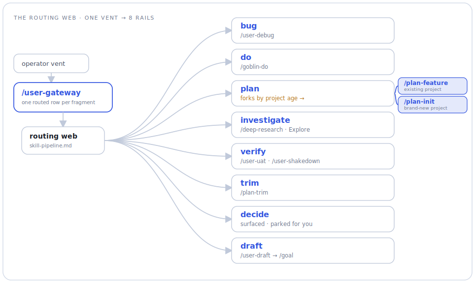
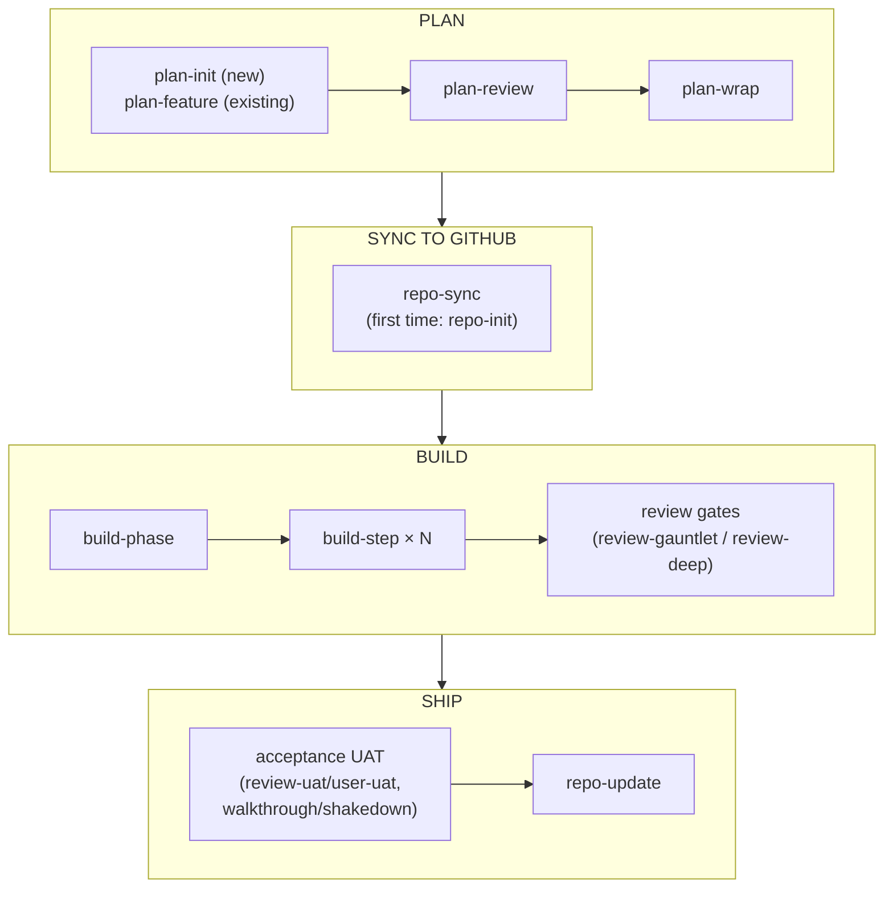
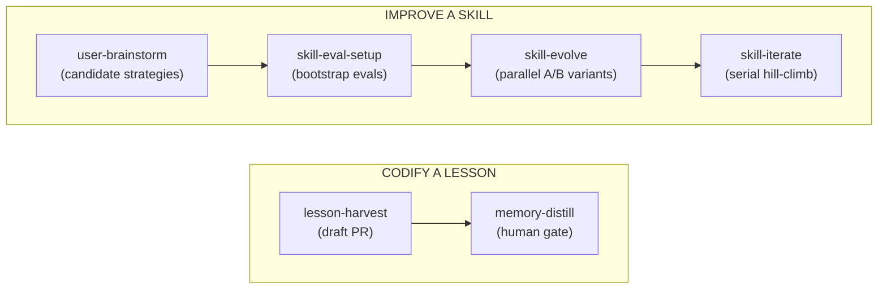

# claude-skills

A collection of [Claude Code](https://docs.anthropic.com/claude-code) skills for planning, building,
reviewing, and shipping software with AI agents. These are the real workflow skills I use day to day,
lightly generalized for sharing.

> Extracted from a personal workspace. Paths and identifiers are generalized to placeholders
> (`<workspace>`, `<project>`, `<your-org>`). A few skills reference personal conventions — a
> workspace "control plane" and a file-based memory system — that you would adapt to your own setup.

## What's inside

Each skill name links to its `SKILL.md`.

**Core pipeline** — plan → build → review → ship:

| Stage | Skills |
|------|--------|
| **Planning** | [plan-init](plan-init/SKILL.md) · [plan-feature](plan-feature/SKILL.md) · [plan-review](plan-review/SKILL.md) · [plan-wrap](plan-wrap/SKILL.md) · [plan-merge](plan-merge/SKILL.md) · [plan-trim](plan-trim/SKILL.md) · [plan-expedite](plan-expedite/SKILL.md) |
| **Building** | [build-step](build-step/SKILL.md) · [build-phase](build-phase/SKILL.md) · [build-queue](build-queue/SKILL.md) |
| **Review** | [review-deep](review-deep/SKILL.md) · [review-gauntlet](review-gauntlet/SKILL.md) · [review-proof](review-proof/SKILL.md) · [review-uat](review-uat/SKILL.md) |
| **Repo & docs** | [repo-init](repo-init/SKILL.md) · [repo-sync](repo-sync/SKILL.md) · [repo-update](repo-update/SKILL.md) |

**Supporting**:

| Area | Skills |
|------|--------|
| **User & session** | [user-brainstorm](user-brainstorm/SKILL.md) · [user-debug](user-debug/SKILL.md) · [user-draft](user-draft/SKILL.md) · [user-gateway](user-gateway/SKILL.md) · [user-learn](user-learn/SKILL.md) · [user-orient](user-orient/SKILL.md) · [user-pm](user-pm/SKILL.md) · [user-shakedown](user-shakedown/SKILL.md) · [user-uat](user-uat/SKILL.md) · [user-walkthrough](user-walkthrough/SKILL.md) · [user-wrap](user-wrap/SKILL.md) · [session-wrap](session-wrap/SKILL.md) · [task-handoff](task-handoff/SKILL.md) · [research-prospect](research-prospect/SKILL.md) |
| **Skill tooling** | [skill-eval-setup](skill-eval-setup/SKILL.md) · [skill-evolve](skill-evolve/SKILL.md) · [skill-iterate](skill-iterate/SKILL.md) |
| **Maintenance & hygiene** | [test-prune](test-prune/SKILL.md) · [lesson-harvest](lesson-harvest/SKILL.md) · [memory-distill](memory-distill/SKILL.md) · [context-slim](context-slim/SKILL.md) |
| **Reference** | [claude-oauth-auth](claude-oauth-auth/SKILL.md) |

`_shared/` holds resources referenced by several skills — the judging doctrine
([judge-core.md](_shared/judge-core.md)), the skill routing web
([skill-pipeline.md](_shared/skill-pipeline.md)), the intake-ledger contract
([intake-engine.md](_shared/intake-engine.md)), and the skill-scoring harness.

The design idea across all of these: treat agent work as a **pipeline with quality gates** — plan,
build one step at a time, review with independent adversarial passes, and only then ship. Several
skills use multi-agent fan-out (parallel reviewers, judge panels, generate-then-grade loops).

## Workflows

The tables above list what each skill *is*; this section maps how they **chain together** in
practice. Every sequence below is a workflow I actually run — commands are copy-pasteable. The
detailed write-ups are collapsed; click a heading to expand it.

Two notes on reading the maps:

- `/goal`, `/loop`, `/schedule`, and `/deep-research` are built-in Claude Code commands, not skills
  in this repo — several skills emit or arm them.
- Pipeline skills are **autonomous by default**: no mid-run "(y/n)?" prompts. Conversational skills
  (`plan-init`, `plan-feature`, `plan-merge`, `plan-trim`, the `user-*` ideation skills) stop and ask
  by design.

### The routing web

The maps below chart the pipeline rails; this one charts **how work reaches a rail in the first
place.** Every operator fragment — a bug report, a half-formed feature idea, a "does this even
work?" — lands on one of **8 rails**, and `/user-gateway` is the intake front door that sorts a
whole brain-dump across them, one ledger row per fragment, inventing nothing of its own. A rail is
a starting guess, not a cage: sanctioned **re-route edges** correct a mis-route mid-run. The
`plan` rail forks by project age — `/plan-feature` for an existing codebase, `/plan-init` to author
a brand-new one (the gateway routes a new-project fragment *to* plan-init; it never authors the
plan itself). The full 8-rail table and all 9 re-route edges live in
[_shared/skill-pipeline.md](_shared/skill-pipeline.md); no skill hardcodes its own routing table.

<picture>
  <source media="(prefers-color-scheme: dark)" srcset="_shared/routing-web-dark.svg">
  
</picture>

The graphic shows where each rail *goes*; the table shows what a fragment *sounds like* to land there:

| Rail | Sounds like | Routes to |
|------|-------------|-----------|
| **bug** | "X is broken / erroring" — a symptom in hand | `/user-debug` |
| **do** | "just do X" — a resolved, small task | `/goblin-do` |
| **plan** | "add / build capability X" — multi-step work | `/plan-feature` (existing) · `/plan-init` (new) → build |
| **investigate** | "what's true about X? why does X happen?" | `/deep-research` · Explore sweep |
| **verify** | "does X actually work? I don't trust X" | `/review-uat` · `/user-uat` · `/user-shakedown` · `/user-walkthrough` |
| **trim** | "the plan feels bloated / what can we cut" | `/plan-trim` |
| **decide** | "should we do A or B?" — an operator-only choice | surfaced, then parked |
| **draft** | "here are rough thoughts" — wants a prompt or a goal | `/user-draft` → `/goal` |

### The core pipeline

Plan → sync → build → ship. Everything else supports this spine.



`plan-expedite` collapses the middle — `plan-review → plan-wrap → repo-sync → handoff` — into one
autonomous command, and ends by printing the exact `/goal` + `/build-phase` pair to paste next.

Ordering matters in two places:

- **plan-review before repo-sync.** A gap caught *after* issues are minted means editing the plan
  plus N issue bodies (the "N+1 edit" trap).
- **repo-sync before build-phase.** build-phase posts live progress to the issues repo-sync
  created; blank `Issue:` lines kill the audit trail.

### Pick your entry point

| Situation | Start with |
|---|---|
| Brand-new project, no code yet | `/plan-init` — §1 |
| Add a feature to an existing project | `/plan-feature` — §2 |
| One well-scoped change, no plan needed | `/build-step` — §3 |
| Stuck in a loop on a bug with the agent | `/user-debug` — §4 |
| Review a diff or PR | `/review-gauntlet` or `/review-deep` — §5 |
| A feature just built needs human acceptance | §6 |
| Several phases ready; run them overnight | `/build-queue` — §7 |
| "Where were we?" / sitting back down at an open window | §8 |
| A head full of half-formed observations about a topic | `/user-gateway` — §8 |
| Plan drifted, or survey what to do next | §9 |
| Improve the skills or the workspace's memory | §10 |
| Explore an idea or learn a topic | §11 |

<details>
<summary><strong>1. New project → shipped v1</strong></summary>

```
/plan-init                          # structured conversation → plan.md
/repo-init                          # first time only: git init, GitHub repo, README, plan → issues
/plan-expedite --plan plan.md       # autonomous: plan-review → plan-wrap → repo-sync → handoff
```

`plan-expedite` finishes by printing a ready-to-paste pair — arm the goal, then build:

```
/goal "<completion condition it emitted>"
/build-phase --plan plan.md
```

Then wrap the phase:

```
/repo-update                        # README, plan doc, memory, commit, posterity issue, push
```

- `plan-init` is gated to greenfield: if the project has *any* commit it stops and redirects to
  `plan-feature`.
- `build-phase` reads `### Step N:` blocks from the plan, spawns one `build-step` per code step,
  posts progress to the GitHub issues, and only halts for five legitimate reasons (quality-gate
  hard fail, wait-type step, merge conflict, bad conditional predicate, stop-and-audit).

</details>

<details>
<summary><strong>2. Feature on an existing project</strong></summary>

Same spine, different front door:

```
/plan-feature <one-liner>                                   # reads the codebase, asks about the delta
/plan-expedite --plan documentation/<feature>-plan.md
/goal "<emitted condition>"
/build-phase --plan documentation/<feature>-plan.md
/repo-update
```

Prefer the à-la-carte version when you want to inspect between stages:

```
/plan-review documentation/<feature>-plan.md    # technical gaps, risks (autofix on by default)
/plan-wrap documentation/<feature>-plan.md      # self-containment for a fresh-context model
/repo-sync --plan documentation/<feature>-plan.md
/build-phase --plan documentation/<feature>-plan.md
```

- `plan-review` and `plan-wrap` check different things: review finds *technical* gaps; wrap checks
  the doc is *self-contained* for a model with zero conversation history (issue bodies and
  autonomous builds depend on that).

</details>

<details>
<summary><strong>3. One-off change, no plan</strong></summary>

```
/build-step --problem "<what to build or fix>" [--issue N]
```

One skill, three independent knobs:

- `--isolation worktree|docker` — where the developer agent works (worktree default).
- `--reviewers auto|code|runtime|full` — `auto` = quality gates only; `code` = 4 parallel
  review-gauntlet agents; `runtime` = 3 evidence-based reviewers; `full` = all seven.
- `--ui --start-cmd "<cmd>" --url <url>` — Playwright evidence capture for frontend steps.

</details>

<details>
<summary><strong>4. Getting unstuck on a bug (user-debug)</strong></summary>

```
/user-debug --symptom '<exact error / log line / misbehavior>'
```

- Reach for it when a bug keeps **circling between you and the agent** — command-paste back-and-forth
  that isn't converging. It forces primary-source investigation and an **independent reproduction
  before any code change**, then delegates the fix to `build-step` and re-runs the original repro to
  prove the symptom is gone.
- It's operator-invoked when *you're* stuck, not a plan-driven step — which is why it lives with the
  `user-*` skills rather than the `build-*` pipeline. (It still writes real code via `build-step`.)
- `--triage investigate-only` stops after the diagnosis block — root cause without the fix.
- If investigation concludes the "bug" is really designed, multi-step work, it re-routes to a
  `/plan-feature` seed instead of forcing a fix (the routing web's bug→plan edge — see
  [_shared/skill-pipeline.md](_shared/skill-pipeline.md)).

</details>

<details>
<summary><strong>5. Reviewing a diff on its own</strong></summary>

Both review skills also run standalone, outside `build-step`:

```
/review-gauntlet <prompt> <diff>     # routine diffs: lean profile over review-deep's engine (5 code lenses, terse verdict)
/review-deep --prompt '<intent>' --diff <PR# | git diff | paste>    # high-stakes: 6 lenses + JSON audit trail
```

- `review-gauntlet` is a **thin profile over review-deep's engine** — the same code lenses
  (correctness, bugs, security, test quality, style) and deterministic aggregation, but
  positional args, a terse PASS / NEEDS-WORK verdict, and no JSON sidecar. Reach for
  `review-deep` on substrate/schema/key-shape changes and producer→consumer chains;
  `--plan-step <plan>:<step>` adds a plan-conformance lens.
- Inside the pipeline, `build-step --reviewers deep` dispatches review-deep directly for
  high-stakes steps, and `plan-review` (§27) routes those steps at plan time by rewriting the
  step's Flags line from `--reviewers code` to `--reviewers deep`.
- `review-proof` is the cross-cutting discipline both lean on: findings must cite `file:line` or
  be dropped. Invoke it directly for "are you sure?" moments — audits, debugging, architecture
  claims.

</details>

<details>
<summary><strong>6. Acceptance testing (UAT)</strong></summary>

After a build, human-facing verification splits by whether a test script exists.

**A script exists** (a plan M-step, a commands+expectations table):

```
/review-uat plan.md#step-M          # refine: explicit prereqs, observable pass criteria, agent/human split
/user-uat plan.md#step-M            # execute: agent runs the mechanical tier, auto-judges with evidence
```

**No script — explore the built thing directly:**

```
/user-walkthrough <feature>         # attended: you drive, agent answers from source, fixes small things live
/user-shakedown <feature>           # autonomous: closes every open ledger item (verify / quick-fix / log)
```

- Walkthrough and shakedown share one ledger, so you can explore attended and then hand the
  remainder to shakedown, armed under a mechanically checkable goal:
  `/goal "shakedown ledger for <slug> has zero open items"`.
- Anything needing human judgment is escalated with evidence, never guessed.
- `review-uat --exec` is refine-then-delegate: it hands the refined script to `/user-uat` for
  execution rather than running anything itself.
- Finish with `/repo-update` to commit the fixes and file the logged issues.

</details>

<details>
<summary><strong>7. Unattended overnight runs</strong></summary>

```
/build-queue --queue <path>         # one line per phase plan
```

- For each queue item it runs `plan-expedite` then `build-phase`, each phase in its own worktree,
  strictly sequential.
- Any halt is **parked** — a GitHub issue with halt context — and the queue moves on; nothing
  retries at 3am. A kill-switch file (`.build-queue-killswitch`) is the only mid-run control.
- You get a morning summary; run `/repo-update` per shipped phase over coffee.

</details>

<details>
<summary><strong>8. Session &amp; context management</strong></summary>

The session doctrine is a **triage front door**: one skill owns the decision; everything else
is a library it calls or a mode it delegates to.

```
/session-wrap                       # the front door: triages (context, task boundary, git, armed /goal), announces ONE route, acts
/session-wrap --advise              # read-only verdict: KEEP GOING / RECYCLE WINDOW / WRAP & CLOSE / SAFE TO CLOSE + loss report
/user-wrap                          # the return moment ("sitting back down — keep going or close?"): orient, delegate to --advise, act
/task-handoff --loop                # checkpoint library: durable current.md write mid-task (~5s)
/task-handoff --next-task <label>   # durable task-boundary save, keep working
/task-handoff                       # bare = --resume: orientation block from the last checkpoint
/user-orient                        # session-axis re-orientation: verified vs not, asides, recommendation (read-only)
/user-orient --quick                # ~150-word thread refresh: problem / tried / still to do (no lookups)
/user-gateway <topic> <vent>        # pre-work intake: convert a brain-dump into routed, ledger-backed work
/user-draft <rough thoughts>        # polish a rough idea into a reusable prompt or a /goal condition
/context-slim [--apply]             # audit auto-loaded context files; prune per-turn token cost
```

- **`session-wrap` is the one triage owner.** Invoked bare at any transition moment, it scores
  mechanical signals (context utilization, task-boundary state from `current.md`, git state,
  armed `/goal`), announces one route, then acts: `continue` (checkpoint + one line),
  `clear-next` (durable state → rendered handoff prompt → git verb → emit `/clear`), or
  `end-window` (full wrap: memory/docs passes + a Pick-up-here block). `--advise` is the
  read-only variant — a verdict banner + two-line loss report, never acts.
- **`user-wrap` serves the return moment** — sitting back down after lunch or overnight.
  Despite the name, the most common verdict is KEEP GOING. It owns zero triage logic of its
  own: it orients from `current.md` + git, delegates the verdict to `session-wrap --advise`,
  re-presents the banner + loss report front and center, then acts per verdict.
- **`task-handoff` is the checkpoint library** orchestrators call (`build-phase`, `build-step`,
  `plan-expedite`, `user-draft`); operators usually want `/session-wrap`.
- **`user-gateway` is the pre-work intake valve**: one ledger row per voiced fragment, routed
  by consulting the routing web, each with a ready-to-paste seed — it converts what you said
  and never proposes work of its own.

See the [**routing web** map](#the-routing-web) near the top for how `/user-gateway` sorts a vent
across all 8 rails.

- The underlying doctrine is *native context management first*: auto-compaction and
  goal-arming handle most sessions, so the default is to keep working in one window and reach
  for the front door only at genuine transition moments.
- `user-draft` is the authoring helper — it turns rough thoughts into a clean prompt or a
  checkable `/goal` string and checkpoints via `task-handoff --loop` so a window pivot loses nothing.

</details>

<details>
<summary><strong>9. Plan &amp; portfolio maintenance</strong></summary>

```
/user-pm [--cut|--goal|--overnight|...]   # read-only PM snapshot: shipped / outstanding / next / cuttable
/plan-trim                                # the write path: propose 3-8 cuts, execute on confirm
/plan-merge <plan-1> <plan-2>             # reconcile overlapping plans into one spine
/research-prospect                        # survey all active projects → menu of /deep-research topics to farm out
```

- `user-pm` prescribes, never executes — its Build/Overnight moves print the ready
  `/plan-*` or `/build-phase` command with prerequisites. `plan-trim` is its writing companion.
- `research-prospect` is the cross-project sibling of `user-pm`: read-only, it surveys every active
  project and emits a prioritized menu of research topics to farm out to other windows.
- After a merge, re-run `/plan-review` + `/plan-wrap` on the merged plan and `/repo-sync` to
  re-cut issues. Originals are archived, never deleted.

</details>

<details>
<summary><strong>10. Improving the skills (and the workspace's memory)</strong></summary>

Two independent tracks operate on the skills themselves and on the workspace's feedback memory.



```
# improve a skill
/user-brainstorm <skill or problem>              # candidate strategies / framings to try
/skill-eval-setup <skill>                        # bootstrap evals.json + scenarios + golden corpus
/skill-evolve --skill <name> --variants <file>   # A/B N variants in parallel; pushes winner, prints gh pr create
/skill-iterate                                   # overnight serial hill-climb (1h or 12 iters per skill)

# codify a lesson
/lesson-harvest --dry-run                        # scan git history + run logs for un-codified regressions → draft PR
/memory-distill                                  # human gate: distill drafts into durable principles (the only memory writer)
```

- The improve track is explore-then-exploit: brainstorm framings, A/B them with `skill-evolve`, then
  hill-climb the winner with `skill-iterate`. (In steady state the two loop — `skill-iterate` runs
  nightly and hands plateaued skills back to `skill-evolve`; see each `SKILL.md`.)
- `skill-evolve` and `skill-iterate` both require the evals folder `skill-eval-setup` creates.
- Nothing self-approves: `skill-evolve` prints the PR command instead of opening it, `lesson-harvest`
  only drafts, and `memory-distill` keeps a human at the write gate.

</details>

<details>
<summary><strong>11. Ideation &amp; learning</strong></summary>

```
/user-brainstorm <topic>            # 10 seed topics + gap-fill rounds → tiered doc set under docs/investigations/
/user-learn <topic>                 # hands-on learning ramp: runnable notebooks, exercises, tracker
```

These are deliberately conversational — they keep you in the loop instead of running the pipeline.

</details>

---

*The through-line: treat agent work as a pipeline with quality gates. Plans are reviewed before
they become issues, every build step is gated by independent reviewers, acceptance is evidence-based,
and even the skills that improve the skills keep a human at the merge gate.*

## Install

<details>
<summary><strong>How to point Claude Code at these skills</strong></summary>

Each top-level folder is one skill. Point Claude Code at them by copying the folders into your skills
directory, or by linking this repo in:

```bash
# copy individual skills
cp -r plan-review ~/.claude/skills/

# or link the whole collection (macOS/Linux)
ln -s "$(pwd)" ~/.claude/skills-shared
```

On Windows, use a directory junction:

```
mklink /J "%USERPROFILE%\.claude\skills-shared" "%CD%"
```

Then invoke a skill in Claude Code, e.g. `/plan-review` or `/build-step`.

</details>

## Adapt before use

- Replace placeholders (`<workspace>`, `<project>`, `<your-org>`) with your own values.
- Skills that reference a "control plane" or a memory index assume conventions from my workspace —
  read the `SKILL.md` and adjust, or skip those skills.
- **The exclusions are deliberate.** A few workspace skills are intentionally not published
  here: the `goblin-*` pair (a personal improvement-atom store), the `tier-*` pair (local-model
  offload scanners tied to a local router), `judge-ui` (needs per-project browser adapters),
  and `user-lavishify` (a workspace-specific rendering stack) — plus a handful of workspace
  reference files (`shakedown-engine.md`, `task-state-schema.md`, the `docs/investigations/`
  corpus). Published skills may mention them; treat those mentions as adaptation points, not
  missing files.
- No secrets or credentials are included.

## License

MIT — see [LICENSE](LICENSE). Built by Abraham Robison ([github.com/aberson](https://github.com/aberson)).
