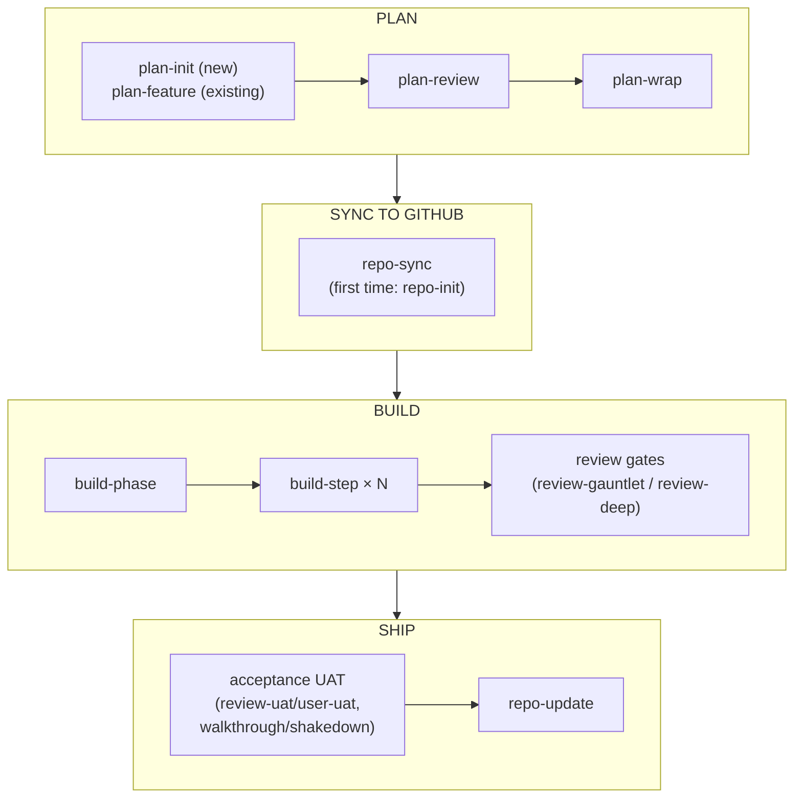
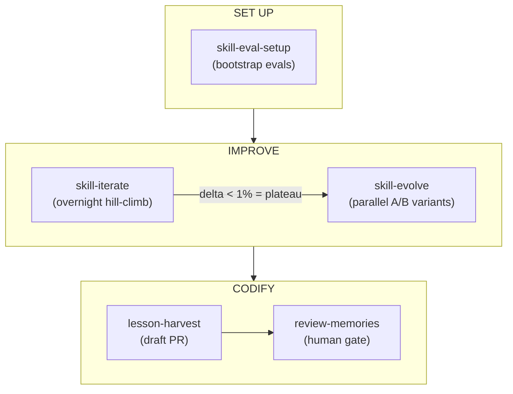

# claude-skills

A collection of [Claude Code](https://docs.anthropic.com/claude-code) skills for planning, building,
reviewing, and shipping software with AI agents. These are the real workflow skills I use day to day,
lightly generalized for sharing.

> Extracted from a personal workspace. Paths and identifiers are generalized to placeholders
> (`<workspace>`, `<project>`, `<your-org>`). A few skills reference personal conventions — a
> workspace "control plane" and a file-based memory system — that you would adapt to your own setup.

## What's inside

| Area | Skills |
|------|--------|
| **Planning** | `plan-init` · `plan-feature` · `plan-review` · `plan-wrap` · `plan-merge` · `plan-trim` · `plan-expedite` |
| **Building** | `build-step` · `build-phase` · `build-queue` · `bug-fix` |
| **Review** | `review-deep` · `review-gauntlet` · `review-proof` · `review-memories` · `review-uat` |
| **Repo & docs** | `repo-init` · `repo-sync` · `repo-update` |
| **User & session** | `user-brainstorm` · `user-draft` · `user-learn` · `user-orient` · `user-pm` · `user-recap` · `user-shakedown` · `user-uat` · `user-walkthrough` · `session-wrap` · `task-handoff` · `context-slim` |
| **Meta / skill tooling** | `skill-eval-setup` · `skill-evolve` · `skill-iterate` · `test-prune` · `lesson-harvest` · `research-prospect` |
| **Auth** | `claude-oauth-auth` |

`_shared/` holds resources referenced by several skills.

The design idea across all of these: treat agent work as a **pipeline with quality gates** — plan,
build one step at a time, review with independent adversarial passes, and only then ship. Several
skills use multi-agent fan-out (parallel reviewers, judge panels, generate-then-grade loops).

## Workflows

The table above lists what each skill *is*; this section maps how they **chain together** in
practice. Every sequence below is a workflow I actually run — commands are copy-pasteable.

Two notes on reading the maps:

- `/goal`, `/loop`, `/schedule`, and `/deep-research` are built-in Claude Code commands, not skills
  in this repo — several skills emit or arm them.
- Pipeline skills are **autonomous by default**: no mid-run "(y/n)?" prompts. Conversational skills
  (`plan-init`, `plan-feature`, `plan-merge`, `plan-trim`, the `user-*` ideation skills) stop and ask
  by design.

### The core pipeline

Plan → sync → build → ship. Everything else supports this spine.



`plan-expedite` collapses the middle — `plan-review → plan-wrap → repo-sync → handoff` — into one
autonomous command, and ends by printing the exact `/goal` + `/build-phase` pair to paste next.

Ordering matters in two places:

- **plan-review before repo-sync.** A gap caught *after* issues are minted means editing the plan
  plus N issue bodies (the "N+1 edit" trap).
- **repo-sync before build-phase.** build-phase posts live progress to the issues repo-sync
  created; blank `Issue:` lines kill the audit trail.

### Pick your entry point

| Situation | Start with |
|---|---|
| Brand-new project, no code yet | `/plan-init` → [workflow 1](#1-new-project--shipped-v1) |
| Add a feature to an existing project | `/plan-feature` → [workflow 2](#2-feature-on-an-existing-project) |
| One well-scoped change, no plan needed | `/build-step` → [workflow 3](#3-one-off-change-no-plan) |
| Something is broken | `/bug-fix` → [workflow 4](#4-bug-fix) |
| Review a diff or PR | `/review-gauntlet` or `/review-deep` → [workflow 5](#5-reviewing-a-diff-on-its-own) |
| A feature just built needs human acceptance | [workflow 6](#6-acceptance-testing-uat) |
| Several phases ready; run them overnight | `/build-queue` → [workflow 7](#7-unattended-overnight-runs) |
| "Where were we?" / context filling up | [workflow 8](#8-session--context-management) |
| Plan has drifted or two plans overlap | [workflow 9](#9-plan-maintenance) |
| Improve the skills themselves | [workflow 10](#10-the-skill-self-improvement-loop) |
| Explore an idea or learn a topic | [workflow 11](#11-ideation-learning-research) |

### 1. New project → shipped v1

```
/plan-init                          # structured conversation → plan.md
/repo-init                          # first time only: git init, GitHub repo, README, plan → issues
/plan-expedite --plan plan.md       # autonomous: plan-review → plan-wrap → repo-sync → handoff
```

`plan-expedite` finishes by printing a ready-to-paste pair — arm the goal, then build:

```
/goal "<completion condition it emitted>"
/build-phase --plan plan.md
```

Then wrap the phase:

```
/repo-update                        # README, plan doc, memory, commit, posterity issue, push
```

- `plan-init` is gated to greenfield: if the project has *any* commit it stops and redirects to
  `plan-feature`.
- `build-phase` reads `### Step N:` blocks from the plan, spawns one `build-step` per code step,
  posts progress to the GitHub issues, and only halts for five legitimate reasons (quality-gate
  hard fail, wait-type step, merge conflict, bad conditional predicate, stop-and-audit).

### 2. Feature on an existing project

Same spine, different front door:

```
/plan-feature <one-liner>                                   # reads the codebase, asks about the delta
/plan-expedite --plan documentation/<feature>-plan.md
/goal "<emitted condition>"
/build-phase --plan documentation/<feature>-plan.md
/repo-update
```

Prefer the à-la-carte version when you want to inspect between stages:

```
/plan-review documentation/<feature>-plan.md    # technical gaps, risks (autofix on by default)
/plan-wrap documentation/<feature>-plan.md      # self-containment for a fresh-context model
/repo-sync --plan documentation/<feature>-plan.md
/build-phase --plan documentation/<feature>-plan.md
```

- `plan-review` and `plan-wrap` check different things: review finds *technical* gaps; wrap checks
  the doc is *self-contained* for a model with zero conversation history (issue bodies and
  autonomous builds depend on that).

### 3. One-off change, no plan

```
/build-step --problem "<what to build or fix>" [--issue N]
```

One skill, three independent knobs:

- `--isolation worktree|docker` — where the developer agent works (worktree default).
- `--reviewers auto|code|runtime|full` — `auto` = quality gates only; `code` = 4 parallel
  review-gauntlet agents; `runtime` = 3 evidence-based reviewers; `full` = all seven.
- `--ui --start-cmd "<cmd>" --url <url>` — Playwright evidence capture for frontend steps.

### 4. Bug fix

```
/bug-fix --symptom '<exact error / log line / misbehavior>'
```

- Forces primary-source investigation and an **independent reproduction before any code change**
  (built to break the run-command → paste-output loop), then delegates the fix to `build-step`
  and re-runs the original repro to prove the symptom is gone.
- `--triage investigate-only` stops after the diagnosis block — useful when you want the root
  cause but not yet the fix.

### 5. Reviewing a diff on its own

Both review skills also run standalone, outside `build-step`:

```
/review-gauntlet                     # routine diffs: 4 parallel lenses (correctness, bugs, tests, style)
/review-deep --prompt '<intent>' --diff <PR# | git diff | paste>    # high-stakes: 5 lenses + JSON audit trail
```

- Reach for `review-deep` on substrate/schema/key-shape changes and producer→consumer chains;
  `--plan-step <plan>:<step>` adds a plan-conformance lens.
- `review-proof` is the cross-cutting discipline both lean on: findings must cite `file:line` or
  be dropped. Invoke it directly for "are you sure?" moments — audits, debugging, architecture
  claims.

### 6. Acceptance testing (UAT)

After a build, human-facing verification splits by whether a test script exists.

**A script exists** (a plan M-step, a commands+expectations table):

```
/review-uat plan.md#step-M          # refine: explicit prereqs, observable pass criteria, agent/human split
/user-uat plan.md#step-M            # execute: agent runs the mechanical tier, auto-judges with evidence
```

**No script — explore the built thing directly:**

```
/user-walkthrough <feature>         # attended: you drive, agent answers from source, fixes small things live
/user-shakedown <feature>           # autonomous: closes every open ledger item (verify / quick-fix / log)
```

- Walkthrough and shakedown share one ledger, so you can explore attended and then hand the
  remainder to shakedown, armed under a mechanically checkable goal:
  `/goal "shakedown ledger for <slug> has zero open items"`.
- Anything needing human judgment is escalated with evidence, never guessed.
- Finish with `/repo-update` to commit the fixes and file the logged issues.

### 7. Unattended overnight runs

```
/build-queue --queue <path>         # one line per phase plan
```

- For each queue item it runs `plan-expedite` then `build-phase`, each phase in its own worktree,
  strictly sequential.
- Any halt is **parked** — a GitHub issue with halt context — and the queue moves on; nothing
  retries at 3am. A kill-switch file (`.build-queue-killswitch`) is the only mid-run control.
- You get a morning summary; run `/repo-update` per shipped phase over coffee.

### 8. Session & context management

```
/user-recap                         # ~150-word thread refresh: problem / tried / still to do
/user-orient                        # full re-orientation: verified vs not, asides, recommendation (read-only)
/task-handoff --loop                # durable checkpoint mid-task (~5s)
/task-handoff --next-task <label>   # save + push at a task boundary, keep working
/task-handoff                       # bare = --resume: orientation block from the last checkpoint
/session-wrap                       # true session end: memory + docs + clean tree + next-window prompt
/context-slim [--apply]             # audit auto-loaded context files; prune per-turn token cost
```

- The doctrine is *native context management first*: auto-compaction and goal-arming handle most
  sessions, so the default is to keep working in one window. `task-handoff` covers in-window
  transitions; `session-wrap` is only for real endings (`--end` delegates to it).
- `context-slim` is periodic maintenance — monthly, or after a big phase ships.

### 9. Plan maintenance

```
/user-pm [--cut|--goal|--overnight|...]   # read-only PM snapshot: shipped / outstanding / next / cuttable
/plan-trim                                # the write path: propose 3-8 cuts, execute on confirm
/plan-merge <plan-1> <plan-2>             # reconcile overlapping plans into one spine
```

- `user-pm` prescribes, never executes — its Build/Overnight moves print the ready
  `/plan-*` or `/build-phase` command with prerequisites. `plan-trim` is its writing companion.
- After a merge, re-run `/plan-review` + `/plan-wrap` on the merged plan and `/repo-sync` to
  re-cut issues. Originals are archived, never deleted.

### 10. The skill self-improvement loop

The meta layer: skills that measure and improve the other skills.



```
/skill-eval-setup <skill>                 # prerequisite: evals.json + scenarios + golden corpus
/skill-iterate                            # overnight: drains every evals-bearing skill, 1h or 12 iters each
/skill-evolve --skill <name> --variants <file>   # plateau-breaker; pushes winner branch, prints gh pr create
/lesson-harvest --dry-run                 # scan git history + run logs for un-codified regressions
/review-memories                          # the only skill allowed to write memory changes
/test-prune                               # audit a project's suite for redundant / mock-theater tests
```

- Iterate is serial *exploitation*, evolve is parallel *exploration*; both refuse to run without
  the evals folder `skill-eval-setup` creates.
- Nothing in this loop self-approves: evolve prints the PR command instead of opening it,
  harvest only drafts, and review-memories keeps a human at the write gate.

### 11. Ideation, learning, research

```
/user-brainstorm <topic>            # 10 seed topics + gap-fill rounds → tiered doc set under docs/investigations/
/user-learn <topic>                 # hands-on learning ramp: runnable notebooks, exercises, tracker
/user-draft <rough thoughts>        # polish into a reusable prompt or a copy-pasteable /goal condition
/research-prospect                  # per-project menu of /deep-research topics to farm out to other windows
```

These are deliberately conversational — they keep you in the loop instead of running the pipeline.

---

*The through-line: treat agent work as a pipeline with quality gates. Plans are reviewed before
they become issues, every build step is gated by independent reviewers, acceptance is evidence-based,
and even the skills that improve the skills keep a human at the merge gate.*

## Install

Each top-level folder is one skill. Point Claude Code at them by copying the folders into your skills
directory, or by linking this repo in:

```bash
# copy individual skills
cp -r plan-review ~/.claude/skills/

# or link the whole collection (macOS/Linux)
ln -s "$(pwd)" ~/.claude/skills-shared
```

On Windows, use a directory junction:

```
mklink /J "%USERPROFILE%\.claude\skills-shared" "%CD%"
```

Then invoke a skill in Claude Code, e.g. `/plan-review` or `/build-step`.

## Adapt before use

- Replace placeholders (`<workspace>`, `<project>`, `<your-org>`) with your own values.
- Skills that reference a "control plane" or a memory index assume conventions from my workspace —
  read the `SKILL.md` and adjust, or skip those skills.
- No secrets or credentials are included.

## License

MIT — see [LICENSE](LICENSE). Built by Abraham Robison ([github.com/aberson](https://github.com/aberson)).
